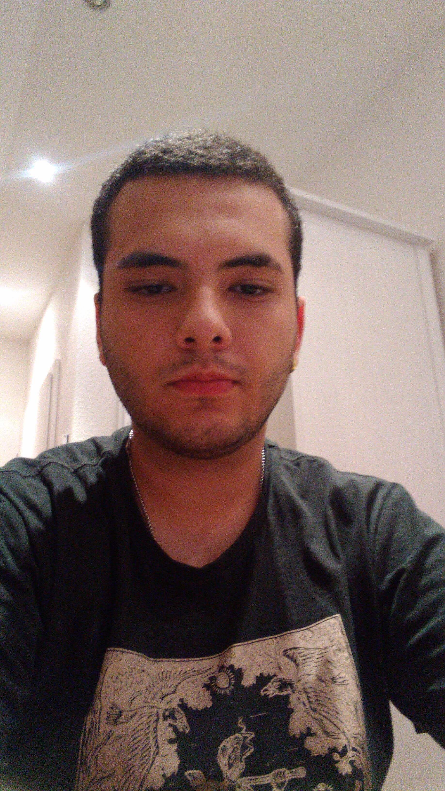

# Projeto Portifólio
## Autor: Pedro Martins de Oliveira 

<p align="center">

</p>

## Tecnologias

* Python
* HTML 5
* CSS3

## Como Utilizar 

1. Criar uma pasta vazia
2. Clonar o repositório com: 
```console 
	git clone https://github.com/OliveiraPedro09/portfolio_digital_dsm
```

(Validação professor FGMC - 1DSM - 2023-02)
